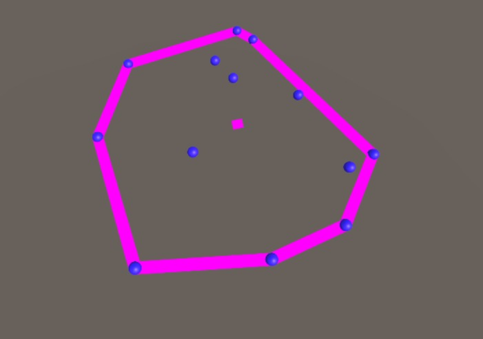

# Unity-QuickHull
QuickHull Implemmentation in Unity C#

## Setup
This was developed with Unity 2017.3 but I believe that olders versions can run it without any problem.
This is a Unity solution, just open it with Unity and you'll be able to see it running.

## Collaborating

Everybody is welcome to improve this solution, feel free to open a pull request.

## Output:

